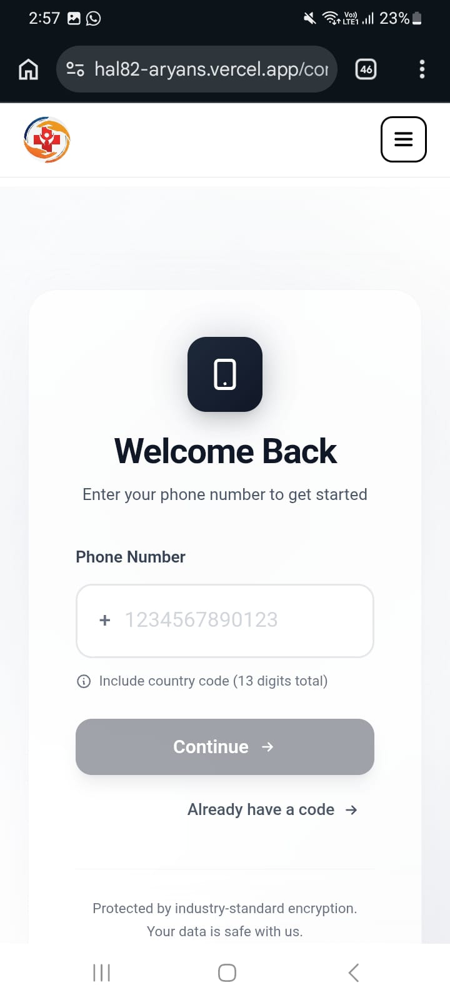
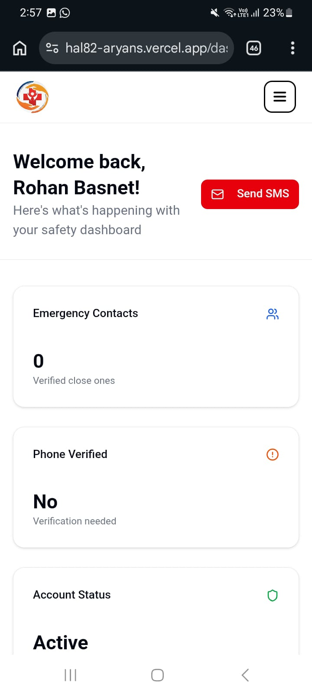
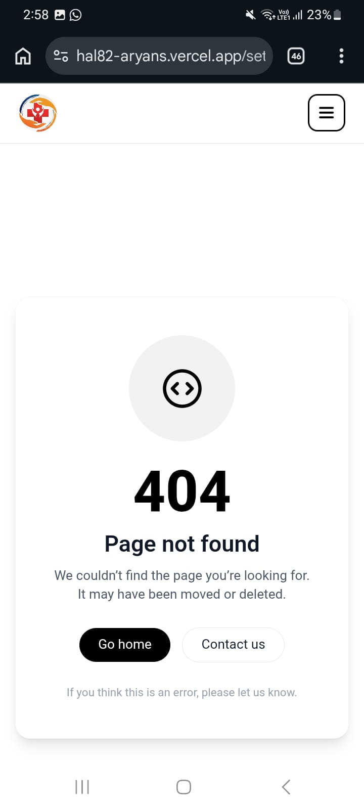
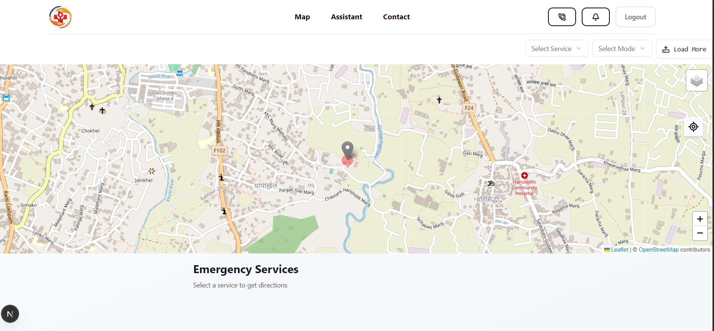
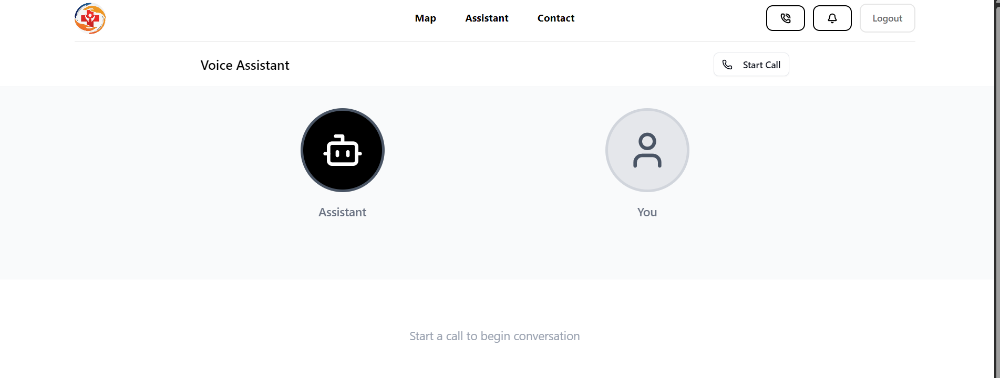
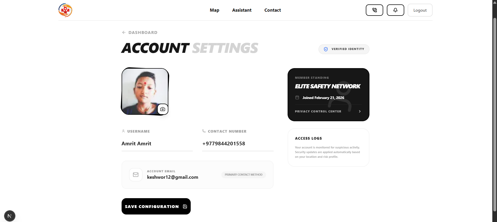

# Emergen

**A safety companion app with real-time location tracking, emergency contacts, AI voice assistant, and interactive mapping.**

Emergen helps you stay connected with your loved ones during emergencies. Verify your phone, add up to 5 close ones with SMS verification, and instantly send your location to all verified contacts at the tap of a button. Find nearby hospitals, clinics, and pharmacies on an interactive map with turn-by-turn directions, or get help via the AI voice assistant.


---

## Table of Contents

- [Features](#features)
- [Screenshots](#screenshots)
- [Tech Stack](#tech-stack)
- [Project Structure](#project-structure)
- [Getting Started](#getting-started)
- [Environment Variables](#environment-variables)
- [Application Flow](#application-flow)
- [API Routes](#api-routes)
- [Database Models](#database-models)
- [License](#license)

---

## Features

### 🛡️ Auth & Safety Network

- **OAuth Sign-in** — Sign in with Google or GitHub (powered by better-auth)
- **Phone Verification** — SMS OTP verification for your primary phone number
- **Close Ones** — Add up to 5 emergency contacts; each contact receives SMS verification
- **Emergency Alert** — One-tap button sends your real-time location to all verified close ones via Twilio SMS

### 🗺️ Interactive Map

- **OpenStreetMap** — Street and satellite layer options
- **Geolocation** — Your live position with automatic tracking
- **Nearby Services** — Find hospitals, clinics, and pharmacies (via Overpass API)
- **Turn-by-Turn Directions** — Driving, cycling, or walking routes (OSRM)
- **Collapsible Route Panel** — Mobile-friendly directions and details

### 🤖 AI Voice Assistant

- **Voice Calls** — Real-time voice conversations via Vapi
- **Live Transcript** — See the conversation transcript as it happens
- **Call Controls** — Start and end calls easily

### 👤 User Management

- **Dashboard** — Overview of contacts, verification status, and quick actions
- **Settings** — Update profile, username, phone, and avatar
- **Terms & Conditions** — Legal and usage terms

---

## Screenshots

### Mobile

| Home | Number Verification | Dashboard | 404 Page |
|------|---------------------|-----------|----------|
|  |  |  |  |

### Desktop

| Dashboard | Map | Assistant | Settings |
|-----------|-----|-----------|----------|
|  |  |  |  |

---

## Tech Stack

| Category | Technology |
|----------|------------|
| **Framework** | Next.js 16 (App Router) |
| **Language** | TypeScript |
| **Database** | PostgreSQL + Prisma ORM |
| **Auth** | better-auth (Google, GitHub OAuth) |
| **Styling** | Tailwind CSS 4 |
| **State** | Zustand |
| **Maps** | Leaflet, react-leaflet, leaflet-routing-machine |
| **AI Voice** | Vapi (@vapi-ai/web) |
| **SMS** | Twilio |
| **UI** | Radix UI, shadcn/ui (new-york), Lucide icons |
| **Animation** | Motion (framer-motion) |
| **Geocoding / Routing** | Overpass API (OSM), OSRM |

---

## Project Structure

```
hackathon/
├── app/                          # Next.js App Router
│   ├── api/                      # API routes
│   │   ├── auth/[...all]/        # Better Auth catch-all
│   │   ├── send-alert/           # Emergency SMS to close ones
│   │   ├── send-sms/             # User phone OTP
│   │   ├── send-sms-closeOne/     # Close one verification OTP
│   │   ├── update-user/          # User profile updates
│   │   ├── verify-user/          # User phone verification
│   │   └── verify-closeOne/      # Close one verification
│   ├── assistant/                # AI voice assistant (Vapi)
│   ├── contacts/                 # Emergency contacts + verification
│   │   └── verify-user/          # User phone OTP entry
│   ├── dashboard/                # Post-login dashboard
│   ├── map/                      # Interactive map + routing
│   │   ├── _components/          # Map-specific components
│   │   ├── _lib/                 # Map helpers
│   │   └── map-client.tsx        # Leaflet map container
│   ├── notification/             # Placeholder (coming soon)
│   ├── settings/                 # User account settings
│   ├── terms&condition/          # Terms & conditions
│   ├── globals.css
│   ├── layout.tsx
│   ├── page.tsx                  # Home
│   └── not-found.tsx             # Custom 404
├── components/
│   ├── ui/                       # shadcn/ui primitives
│   ├── contact/                  # Phone verification + AddCloseOne
│   ├── dashboard/                # DashboardContent
│   ├── hero/                     # HeroSection, HowItWorks
│   ├── Navbar.tsx
│   ├── LoginDialog.tsx
│   ├── smsButton.tsx             # Emergency alert button
│   └── userLocation.tsx
├── lib/
│   ├── action/                   # Server actions
│   ├── auth.ts                   # Better Auth config
│   ├── prisma.ts
│   ├── twilio.ts
│   ├── vapi.ts
│   └── utils.ts
├── store/                        # Zustand state
│   ├── userStore.ts
│   └── leafletStore.ts
├── prisma/
│   └── schema.prisma
├── public/                       # Static assets & screenshots
├── next.config.ts
├── package.json
└── tsconfig.json
```

---

## Getting Started

### Prerequisites

- Node.js 18+
- PostgreSQL
- Twilio account (for SMS)
- Vapi account (for AI voice assistant)
- Google & GitHub OAuth apps (for auth)

### Installation

1. Clone the repository:

   ```bash
   git clone <repository-url>
   cd hackathon
   ```

2. Install dependencies:

   ```bash
   npm install
   ```

3. Set up environment variables (see [Environment Variables](#environment-variables)).

4. Initialize the database:

   ```bash
   npx prisma migrate dev
   npx prisma generate
   ```

5. Run the development server:

   ```bash
   npm run dev
   ```

6. Open [http://localhost:3000](http://localhost:3000) in your browser.

### Build & Production

```bash
npm run build
npm start
```

---

## Environment Variables

Create a `.env` file in the project root with:

| Variable | Description |
|----------|-------------|
| `DATABASE_URL` | PostgreSQL connection string for Prisma |
| `GITHUB_CLIENT_ID` | GitHub OAuth App Client ID |
| `GITHUB_CLIENT_SECRET` | GitHub OAuth App Client Secret |
| `GOOGLE_CLIENT_ID` | Google OAuth Client ID |
| `GOOGLE_CLIENT_SECRET` | Google OAuth Client Secret |
| `TWILIO_ACCOUNT_SID` | Twilio Account SID |
| `TWILIO_AUTH_TOKEN` | Twilio Auth Token |
| `TWILIO_PHONE_NUMBER` | Twilio phone number for sending SMS |
| `NEXT_PUBLIC_VAPI_PUBLIC_KEY` | Vapi public key for voice assistant |
| `NEXT_PUBLIC_VAPI_ASSISTANT_ID` | Vapi assistant ID |
| `NEXT_PUBLIC_OSRM_SERVICE_URL` | (Optional) Custom OSRM service URL |
| `USER_AGENT_EMAIL` | User agent for Overpass API requests |

---

## Application Flow

1. **Landing** — User sees the hero section, features, and how it works. Logged-in users are redirected to `/dashboard`.

2. **Authentication** — Sign in via Google or GitHub; sessions are managed by better-auth.

3. **Phone Verification** — On first visit to `/contacts`, unverified users see the phone verification flow. Enter number → receive OTP → verify on `/contacts/verify-user`.

4. **Close Ones** — After verification, add up to 5 emergency contacts. Each contact receives OTP via SMS and must be verified.

5. **Dashboard** — Overview of contacts, verification status, and quick links (Map, Contacts, Assistant, Settings).

6. **Map** — Your location from geolocation; select hospital/clinic/pharmacy; nearby places fetched via Overpass API; OSRM builds routes for driving/cycling/walking.

7. **Emergency Alert** — Tap **Send SMS** to send your name and coordinates to all verified close ones via Twilio.

8. **Assistant** — Start a voice call with the Vapi AI agent; transcripts displayed in real time.

9. **Settings** — Update username, phone; changes persist via server actions and `/api/update-user`.

---

## API Routes

| Route | Method | Description |
|-------|--------|-------------|
| `/api/auth/[...all]` | * | Better Auth catch-all (session, OAuth callbacks) |
| `/api/send-sms` | POST | Send OTP to user phone |
| `/api/verify-user` | POST | Verify user OTP |
| `/api/send-sms-closeOne` | POST | Send OTP to close one |
| `/api/verify-closeOne` | POST | Verify close one OTP |
| `/api/send-alert` | POST | Send emergency SMS to all verified close ones |
| `/api/update-user` | POST | Update user profile |

---

## Database Models

### User

- `id`, `name`, `email`, `emailVerified`, `image`, `createdAt`, `updatedAt`
- `isVerified`, `phoneNumber`, `verificationCode`, `verificationCodesExpiresAt`
- Relations: `sessions`, `accounts`, `closeOnePhoneNumbers` (CloseOne[])

### CloseOne

- `id`, `phoneNumber`, `isVerified`, `verificationCode`, `name`, `userId`
- `createdAt`, `updatedAt`
- Belongs to `User` (cascade delete)

### Session & Account

- Managed by better-auth for OAuth and session handling.

### Verification

- Used by better-auth for verification records.

---

## Routes & Pages

| Route | Access | Description |
|-------|--------|-------------|
| `/` | Public | Landing with hero, features, how it works |
| `/dashboard` | Auth | Main dashboard after login |
| `/map` | Auth | Interactive map, nearby services, routing |
| `/assistant` | Auth | AI voice assistant |
| `/contacts` | Auth | Add/manage close ones; user phone verification |
| `/contacts/verify-user` | Auth | Enter OTP for user phone |
| `/settings` | Auth | Account settings |
| `/notification` | Auth | Placeholder (coming soon) |
| `/terms&condition` | Public | Terms & conditions |
| 404 | — | Custom not-found page |

Protected routes require a valid session; unauthenticated users are redirected to `/`.

---

## License

This project is private. All rights reserved.
